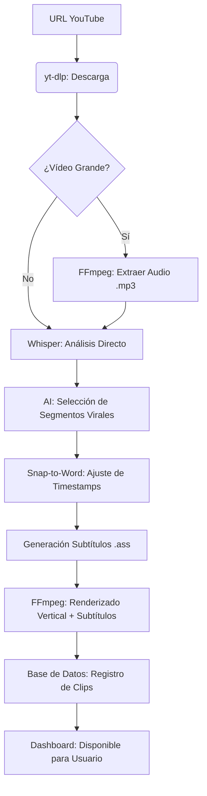
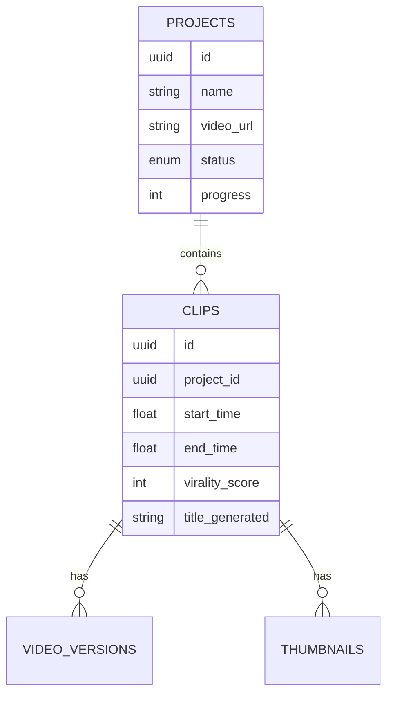

# 🧠 Arquitectura Profunda y Manual Técnico - Project Sovereign

Este documento es el manual técnico definitivo de **Project Sovereign**. Proporciona una inmersión granular en la lógica de IA, los filtros de procesamiento de vídeo y el esquema de datos para desarrolladores y operadores de sistemas.

---

## 📑 Tabla de Contenidos
1. [El Núcleo: ViralEngine](#1-el-núcleo-viralengine)
2. [Lógica de IA y Prompt Engineering](#2-lógica-de-ia-y-prompt-engineering)
3. [Pipeline de Audio y Transcripción](#3-pipeline-de-audio-y-transcripción)
4. [Renderizado y Filtros FFmpeg](#4-renderizado-y-filtros-ffmpeg)
5. [Infraestructura de Datos (PostgreSQL)](#5-infraestructura-de-datos-postgresql)
6. [Frontend y Sincronización de Estado](#6-frontend-y-sincronización-de-estado)
7. [Guía de Solución de Problemas Avanzada](#7-guía-de-solución-de-problemas-avanzada)

---

## 1. El Núcleo: `sovereign_core.py` (ViralEngine)

El `ViralEngine` orquesta la integración de múltiples APIs (Gemini, Groq) y herramientas de procesamiento local (Whisper, FFmpeg). 

### 1.1 Configuración de Memoria y Rendimiento
Para garantizar estabilidad en servidores con recursos limitados (ej. sin GPU dedicada), el motor utiliza:
- **`fp16=False` en Whisper**: Forzamos precisión float32 para evitar artefactos en CPUs que no soportan instrucciones de media precisión.
- **Audio Extract Prefetch**: Extracción de audio en `.mp3` (mono, 128k) para reducir el overhead de Whisper de ~1000MB (vídeo 4K) a ~50MB (audio).

```python
# Lógica de extracción optimizada
cmd = [self.ffmpeg_path, '-y', '-i', video_path, '-vn', '-acodec', 'libmp3lame', '-q:a', '2', audio_path]
```

---

### 2.1 Ingeniería de Prompts: El Editor Elite
Sovereign no usa simples resúmenes. Inyecta una **psicología de retención** en la IA:
- **Hook (0-3s)**: Se instruye a la IA para buscar "patrones de interrupción de patrón" (preguntas impactantes, contradicciones).
- **Sweet Spot de 20-55s**: Optimizado para el algoritmo de YouTube que beneficia clips de ~45s con retención >70%.
- **Autonomía Semántica**: La IA filtra fragmentos que referencian a "como dije antes" o "mira este gráfico", priorizando contenido que se explica solo.

---

## 3. Pipeline de Audio y Transcripción (Ultra-Precisión)

La alineación de subtítulos se basa en un mapeo de **3 capas**:
1. **Raw Whisper**: Genera el mapa de probabilidad de palabras.
2. **Normalización de Timestamps**: Ajustamos el `start` y `end` con un padding de **0.2s** para evitar el efecto de "corte de sílaba".
3. **Snap-to-Word**: Si la IA sugiere un corte en el segundo 15.5, el motor busca la palabra más cercana en el transcript para ajustar el corte a un silencio natural.

---

## 4. Renderizado y Filtros FFmpeg (Nivel Kernel)

El comando de renderizado es el corazón de la producción visual:

```bash
ffmpeg -ss [start] -t [duration] -i source.mp4 \
-vf "crop=1080:1920:x:0,ass=subtitles.ass" \
-c:v libx264 -preset fast -crf 23 -c:a aac -b:a 128k output.mp4
```

- **`-crf 23`**: Balance óptimo entre tamaño de archivo y calidad visual (balance visual transparente).
- **`-preset fast`**: Optimizado para velocidad de codificación en servidores multi-core.
- **Filtro `ass`**: Quema los subtítulos directamente en los frames de vídeo, eliminando la necesidad de que el reproductor soporte subtítulos externos.

---

## 5. Arquitectura de Estado y Polling

Sovereign evita la complejidad de WebSockets mediante un sistema de **Estado Consistente**:

1. **Worker (Python)**: Escribe periódicamente en `projects.progress`.
2. **API (Next.js)**: Lee de la DB con `pg-adapter`.
3. **Frontend (React)**: Usa un `setInterval` de 3000ms con re-validación de caché de Next.js para mostrar la barra de progreso.

---

## 6. Infraestructura de Datos (Relacional)

## 5. Flujo de Ejecución Detallado



## 6. Referencia de API (Backend/Front Bridge)

El sistema utiliza rutas de API de Next.js para interactuar con los scripts de Python:

- `POST /api/projects`: Inicia un nuevo trabajo de ingesta.
- `GET /api/projects/[id]`: Consulta el progreso (0-100%) y estado.
- `GET /api/clips/available`: Lista todos los clips procesados satisfactoriamente.
- `POST /api/enterprise/audio-pro`: Dispara el post-procesamiento de audio.

## 7. Esquema de Base de Datos (PostgreSQL)



## 6. Variables de Entorno (.env)

Es fundamental tener estas claves configuradas correctamente:
- `GEMINI_API_KEY`: Clave de Google AI.
- `GROQ_API_KEY`: Alternativa de alto rendimiento.
- `DATABASE_URL`: Conexión directa a PostgreSQL o Docker.

## 7. Solución de Problemas Comunes

| Error | Causa Probable | Solución |
|-------|----------------|----------|
| `MemoryError` | Vídeo demasiado grande para la RAM. | El motor ahora extrae audio automáticamente. Verifica swap. |
| `429 Too Many Requests` | Límite de API Gemini. | El motor usa Groq como fallback automático. |
| `FileNotFoundError: ffmpeg` | FFmpeg no está en el PATH. | El script busca en `./data/ffmpeg.exe` por defecto. |
| `DB Connection Failed` | Docker no iniciado. | Ejecuta `docker-compose up -d`. |

## 8. Enterprise Hub: Automatización y Post-Procesamiento

Project Sovereign no es solo un generador de clips; es un sistema de producción autónomo.

### 8.1 Auto-Pilot (`autopilot.py`)
El módulo de Autopilot permite la operación "manos libres" mediante:
- **Canal de Escucha**: Monitorea canales de YouTube específicos cada 60 minutos.
- **Auto-Ingest**: Dispara el pipeline de `ingest.py` automáticamente al detectar un nuevo vídeo.
- **Categorización Inteligente**: Filtra clips no solo por virality_score, sino por etiquetas (Storytelling, Educational, etc.) definidas en el perfil del usuario.

### 8.2 Clip Post-Processor (`clip_post_processor.py`)
Para evitar los cortes bruscos típicos de los generadores básicos, Sovereign utiliza un algoritmo de **Detección de Silencios Naturales**:
1. Busca el `min_gap` (default 0.5s) después del timestamp final sugerido por la IA.
2. Analiza palabras clave del "payoff" para asegurar que la idea central no se corte.
3. Ajusta el `end_time` dinámicamente, mejorando la retención del usuario final.

### 8.3 Smart Crop e IA Facial
Cuando se activa el **Enterprise Crop**, el sistema mapea las coordenadas (X, Y) de la cara detectada en el frame original (1920x1080) y traslada esa ventana al espacio vertical (1080x1920), aplicando una interpolación suave para evitar saltos de cámara.

---

## 9. Sincronización Frontend-Backend (Next.js)

La comunicación entre el dashboard y los procesos de Python se realiza mediante **Polling Constante**:
- El Frontend realiza una petición `GET` a `/api/projects/[id]` cada 3 segundos.
- La API de Next.js consulta la base de datos PostgreSQL.
- El script de Python actualiza el campo `progress` y `project_status` en la DB en tiempo real.

---

## 10. Escalabilidad y Futuro

Project Sovereign está diseñado para ser modular. Algunas mejoras potenciales incluyen:
- **Procesamiento Paralelo**: Utilizar `Celery` o `Redis Queue` para procesar múltiples vídeos simultáneamente.
- **Detección de Caras Avanzada**: Reinstalar MediaPipe en un entorno Dockerizado robusto para tracking dinámico.
- **Sincronización Cloud**: Subida automática a YouTube Shorts / TikTok mediante APIs de terceros.

---
*Este documento es auto-explicativo y permite a cualquier desarrollador (o IA) entender la lógica de negocio completa de Sovereign.*
*Versión: 2.1 (Production Ready)*
*Actualizado: 15 Feb 2026*
